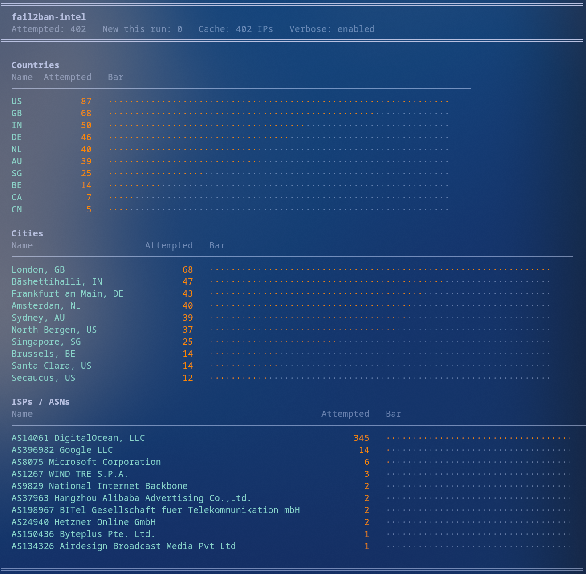
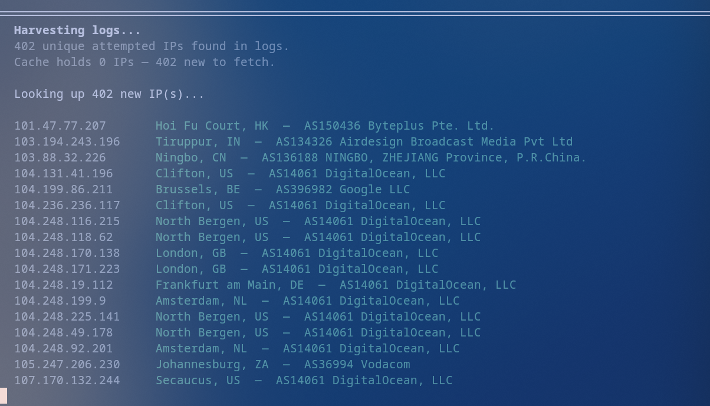

## fail2ban-intel

A fail2ban log analyser that enriches attempted intrusion IPs with geolocation and ISP data, showing ranked insights on where attacks are coming from.

## Setup

1. Clone the repo and install dependencies:
   ```bash
   git clone https://github.com/itsbt125/fail2ban-intel && cd fail2ban-intel && pip install -r requirements.txt
   ```

2. Add your [ipinfo.io](https://ipinfo.io) token to `data/settings.json` (they have a generous free tier):
   ```json
   {
     "api_token": "your_token_here"
   }
   ```

3. Run:
   ```bash
   python3 main.py
   ```

## Configuration

All settings live in `data/settings.json`.

| Key              | Default                     | Description                        |
|------------------|-----------------------------|------------------------------------|
| `api_token`      | `your_token_here`           | ipinfo.io API token (required)     |
| `top_n`          | `10`                        | Results per section (0 = all)      |
| `bar_width`      | `64`                        | Max bar width in the report        |
| `log_glob`       | `/var/log/fail2ban.log*`    | Path to fail2ban logs              |
| `attempted_file` | `data/attempted.txt`        | Output file for harvested IPs      |
| `cache_file`     | `data/cache.json`           | Cache file for API results         |
| `verbose`        | `false`                     | Print each IP as it's fetched      |
| `char_filled`    | `·`                         | Character for filled bar           |
| `char_empty`     | `·`                         | Character for empty bar            |

## Bare Structure (not including cache or logs)

```
fail2ban-intel/
├── main.py
├── README.md
├── requirements.txt
├── data/
│   └── settings.json
├── imgs/
│   ├── 1.png
│   └── 2.png
└── scripts/
    ├── cache.py
    ├── display.py
    ├── harvest.py
    ├── lookup.py
    └── settings.py
```

## Notes

- Requires `sudo` access to read `/var/log/fail2ban.log*`
- API results are cached in `data/cache.json` — only new IPs are looked up via the API  on each run
- Uses [ipinfo.io](https://ipinfo.io) Lite (free, unlimited requests)
- Bulk reporting support to AbuseIPDB is coming soon!


